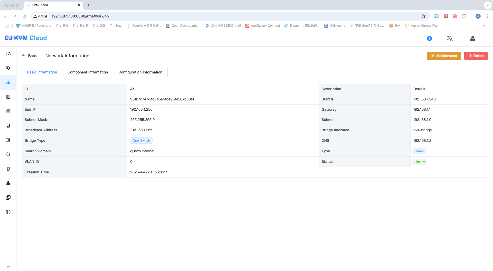
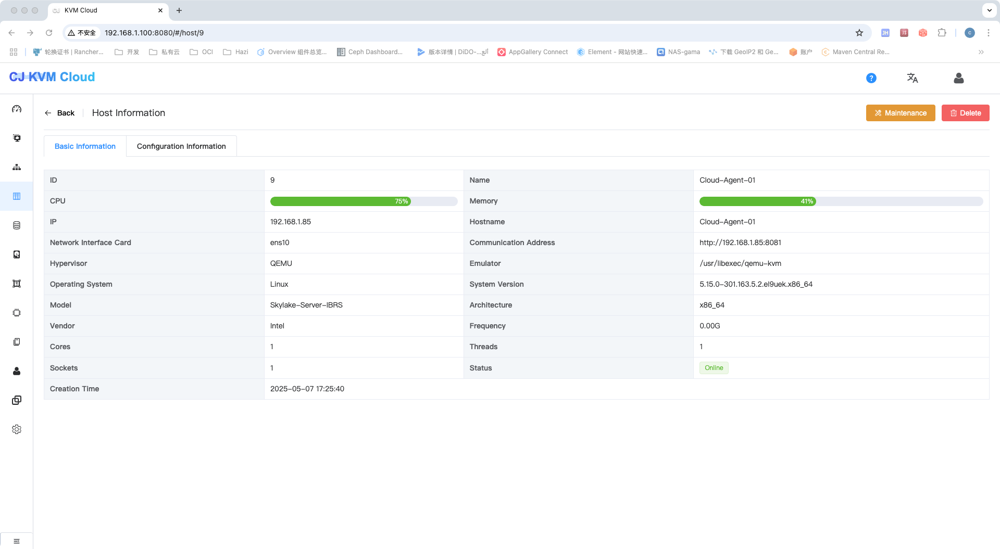
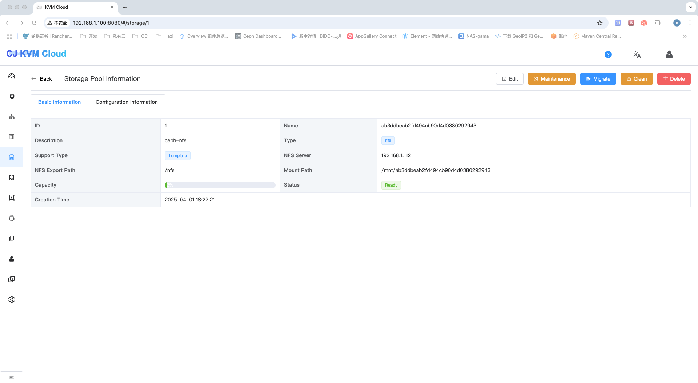
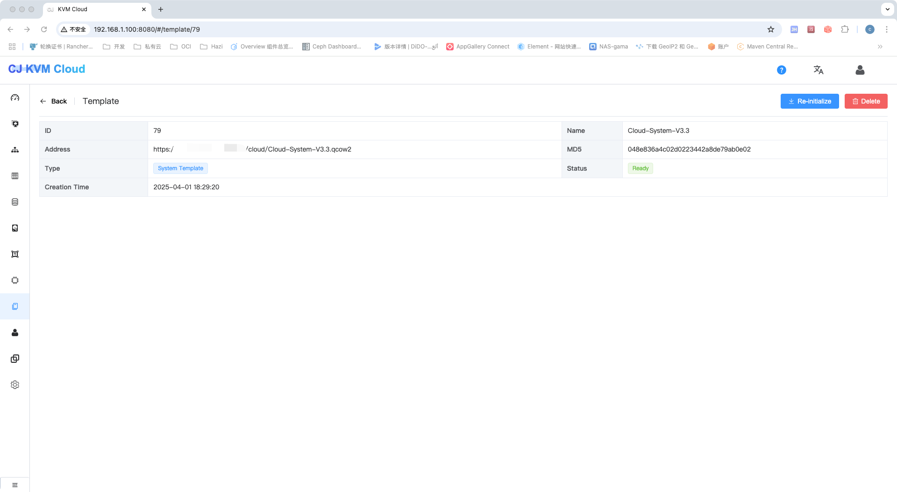
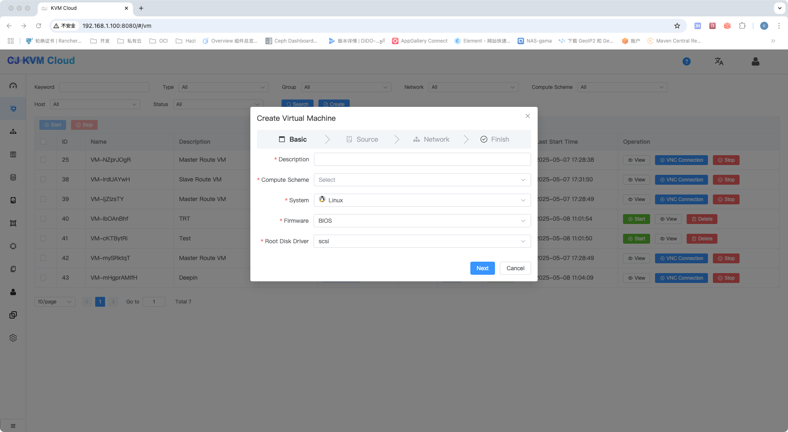
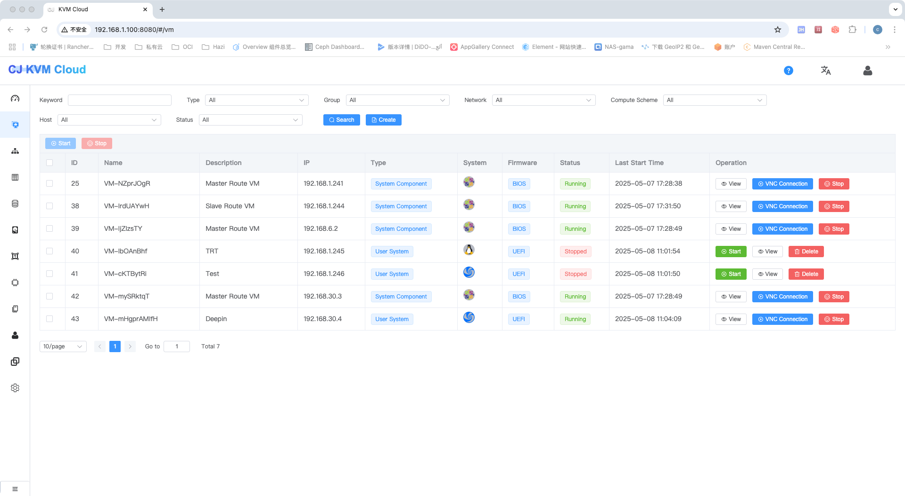
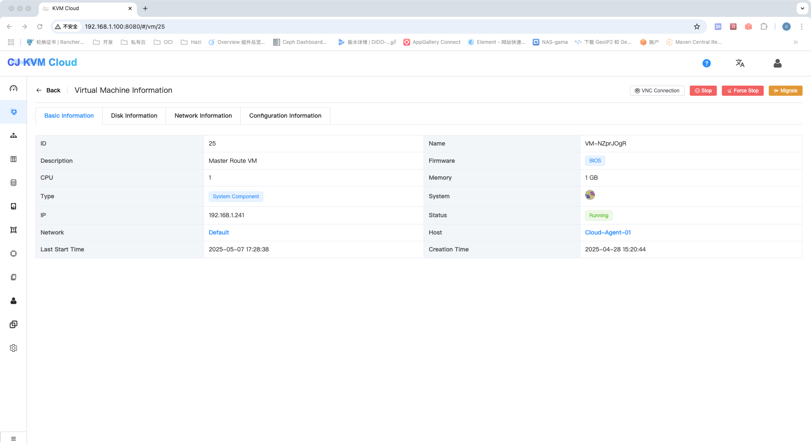

English | [中文](README.md)
### Project Introduction
KVM Cloud is a lightweight private cloud platform implemented in Java, designed to help small and medium-sized enterprises quickly manage computing, storage, and network resources, allowing enterprises to have their own cloud platform. The platform includes, but is not limited to, the following features:
- Basic VM functions based on KVM (creation, start, stop, reinstallation, webVNC, etc.)
- Support for NFS, glusterfs, and Ceph RBD disk storage pools
- Support for dynamic addition and removal of disks
-  Multi-host management
- Support for template maintenance for quick VM creation
- Automatic management of virtual machine IPs
- Support for multiple network cards
- Support for VLAN network segmentation through OVS
- Support for cloud-init to configure vm
- Support for internal DNS resolution
- Support for NAT forwarding
- Support for key management login
- Support for hostname customization

### About Upgrade
- Currently, upgrades from V1 and V2 to the latest version are not supported.
- When upgrading from V3.2, please re-upload the system template file Cloud-System-v3.3.qcow2 (md5: d91d1d3e4e9d78593f5727faebf0510e), stop the existing network components, and reinitialize them.
- The new version no longer supports the backingfile method. Before upgrading, ensure that all disk files do not depend on parent disks. If they do, clone the disks to remove the dependency. Otherwise, deleting the template will render the disks unusable.

### Operating System
Linux(intel、amd)
### SELinux Configuration
```$xslt
setenforce 0
vi /etc/selinux/config
SELINUX=permissive
```
### Sysctl Configuration
```$xslt
vim /etc/sysctl.conf 
net.ipv4.ip_forward=1               # 设置转发并保存
sysctl -p
```
### Firewall Configuration
```sh
systemctl stop firewalld
systemctl disable firewalld
systemctl stop iptables
systemctl disable iptables
systemctl stop NetworkManager
systemctl disable NetworkManager
```
### NFS Configuration
#### 1. Install NFS Packages
```sh
yum -y install nfs-utils rpcbind
```
#### 2. Set Up Automatic Start and Start Services
```sh
systemctl enable rpcbind
systemctl enable nfs-server
systemctl start rpcbind
systemctl start nfs-server
```
#### 3. Create Storage Directory
```sh
mkdir -p /data/nfs
```
#### 4、Edit Configuration
```$xslt
vi /etc/exports
/data/nfs *(rw,sync,no_root_squash)
```
#### 5、Reload the exportfs File
```sh
exportfs -a
```
#### 6. Restart Services
```sh
systemctl restart rpcbind
systemctl restart nfs-server
```

#### 7. Test Mounting
```sh
mount -t nfs 127.0.0.1:/data/nfs /mnt
df -h
umount /mnt
```

### KVM
#### 1、Verify Host Support for Virtualization
```$xslt
lsmod | grep kvm # Check the result to confirm if virtualization is supported
If the host is a VMware virtual machine, enable virtualization technology.
```
#### 2、Install KVM on the Host
```sh
yum install qemu-kvm libvirt bridge-utils
yum install java-1.8.0-openjdk* -y
```

#### 3、Configure KVM Host Bridge, Add a Bridge
    Note: Use ip addr to check your network interface name. In CentOS 7, the interface name may not be eth0. An incorrect interface name will cause the virtual machine to be inaccessible later. 
    Confirm the correct interface name and configure the bridge:

1)、Create the bridge network interface file:/etc/sysconfig/network-scripts/ifcfg-br0
```$xslt
DEVICE=br0
TYPE=Bridge
ONBOOT=yes
BOOTPROTO=static
IPADDR=192.168.2.130
NATMASK=255.255.255.0
PREFIX=24
GATEWAY=192.168.2.1
DNS1=8.8.4.4
DNS2=8.8.8.8 
```
2)、Modify the default network interface configuration

> **Edit the file to match the actual interface name, for example, ifcfg-eth0, located at:/etc/sysconfig/network-scripts/ifcfg-eth0**
```$xslt
BOOTPROTO=none
NAME=eth0
DEVICE=eth0
ONBOOT=yes
NM_CONTRLLED=no
BRIDGE=br0
```
3)、For OVS configuration, refer to [ovs-bridge-sample.md](scripts/ovs-bridge-sample.md)

#### 4、VNC Configuration
```$xslt
vi /etc/libvirt/qemu.conf
vnc_listen="0.0.0.0"
user = "root"
group = "root"
```
#### 5、Libvirtd Configuration

1)、libvirtd configuration
```$xslt
vi /etc/libvirt/libvirtd.conf
listen_tls = 0
listen_tcp = 1
unix_sock_group = "root"
unix_sock_rw_perms = "0777"
auth_unix_ro = "none"
auth_unix_rw = "none"
tcp_port = "16509"
listen_addr = "0.0.0.0"
auth_tcp = "none"
vi /etc/sysconfig/libvirtd
LIBVIRTD_ARGS="--listen"
systemctl restart libvirtd 
```
#### Project Compilation
```sh
mvn clean package -Dfile.encoding=UTF-8 -DskipTests=true
```
### Completion of Configuration
1、Import MySQL tables and related data
> **Scripts are located in the scripts directory**

2、Install Redis

3、Modify configuration files

4、Start the management and agent ends, and browse the page：http://localhost:8080/
```$xslt
Management: java -jar cloud-management-1.0-SNAPSHOT.jar --spring.config.location=server.yaml
Agent: java -jar cloud-agent-1.0-SNAPSHOT.jar --spring.config.location=client.properties
--spring.config.location is an optional parameter used to specify the configuration file. If no modification is needed, you can omit it. The configuration files are located in the src/main/resources directory of each module.
```

5、Default login credentials for the platform: admin/123456

6、Create the basic network

> **Use bridge network configuration. The IP address range should be consistent with the host's IP segment. You can separate the start and end IP addresses from the host's network to avoid IP conflicts. VLAN is only supported in OVS mode.**




7、Create the host`
`




8、Create storage pools




9、Download the base template (system template: cloud/v3/Cloud-System-V3.3.qcow2)

> **Baidu Netdisk link: https://pan.baidu.com/s/1bOAeuvFj8hG4skDaoZnYtQ?pwd=1bpn Extraction code: 1bpn**


10、Install Nginx, configure the base download URL, and complete the template configuration on the page





11、Wait for the system template to download and initialize the system VM successfully

12、For Windows, install the virtio-win.iso driver when attaching disks


13、Create VMs










### Related Issues

1、Configuration file not found issue leading to database connection problems
```$xslt
server.yaml and client.properties are the application.yaml and application.properties files in the management and agent projects, respectively. Modify the names and related configurations as needed when running.
```
2、Backup and recovery
```$xslt
Perform a complete backup of the database and storage pool；
Data is invaluable, it is recommended to back up data in virtual machines.
```
3、Network isolation
```$xslt
1) Currently, only VLAN mode is supported in OVS bridge state. If needed, install OVS.
2) Load balancers can be implemented by mounting the basic network interface.

```
4、Boot issues with some Windows systems
```$xslt
1) First, confirm that the ISO system type is correct.
2) If the system type is confirmed to be correct, you can create a PE ISO image using Laomaotao. When creating the system, use the PE image, enter the PE system, unmount the CD, and re-mount the operating system you want to install, then install it through PE.
```
5、Disk recognition issues with Windows systems
```$xslt
1) Windows lacks the virtio driver, install the virtio-win.iso driver.
2) If it is a system disk, temporarily mount the virtio-win.iso driver during disk selection or choose the IDE bus method.
```
6、Handling server power loss and reboot
```$xslt
1. After a server power loss and reboot, manually shut down all the virtual machines you created on the page, then restart them. The system VMs have an automatic detection and restart function, so no action is needed.
2. A power loss may cause virtual disk damage. If the VM cannot start, use `qemu-img check` to check and perform the necessary repairs.
``` 
7、Nested virtualization
```$xslt
1. Verify if nested virtualization is enabled on the KVM host:
   - For Intel processors, run the following command: `cat /sys/module/kvm_intel/parameters/nested`
   - For AMD processors, run the following command: `cat /sys/module/kvm_amd/parameters/nested`
   - If the output is N/0, nested virtualization is disabled. If the output is Y/1, nested virtualization is enabled on your host.
2. If you need to enable nested virtualization, create a file named /etc/modprobe.d/kvm-nested.conf with the following content:    options kvm-intel nested=1
    options kvm-intel enable_shadow_vmcs=1
    options kvm-intel enable_apicv=1
    options kvm-intel ept=1
3. Reboot the machine
4. Verify if nested virtualization is enabled
    cat /sys/module/kvm_intel/parameters/nested
``` 
8、cloud-init related configuration
```$xslt
1. The cloud-init data source uses NoCloud. Modify the cloud configuration as follows:
    datasource:
      NoCloud:
        seedfrom: http://169.254.169.254/
    datasource_list: [  NoCloud ]

2. After installing cloud-init, manually set the related configurations in the system template:
    1) Enable password login: set `ssh_pwauth: 1` 
    2) Enable root login: set `disable_root: 1` 
    3) For Ubuntu, modify /etc/cloud/cloud.cfg.d/50-curtin-networking.cfg to ensure the default network interface name matches the assigned network interface name. 
    4) Currently, only CentOS and Ubuntu have been tested. For Windows, implement the related initialization behavior yourself. 
    5) The password only corresponds to the default user. For more details, see the `system_info.default_user` configuration. 
    6) Refer to cloud-init related configurations for other settings. 
    7) Install and configure `qemu-command-agent` in the system template. 
     
3. Currently, only CentOS and Ubuntu 22.04 system templates are provided. For other system templates, implement them yourself.
    1) The default username for CentOS is `centos`, and the password is the one you input during system creation. 
    2) The default username for Ubuntu is `ubuntu`, and the password is the one you input during system creation. 
    3) The system template does not support root username and password login. If you need root login, modify it yourself. 
    
4、4. For the issue of Ubuntu 22.04 not being able to log in with a key in custom templates, execute the following commands:
    1）、echo 'PubkeyAcceptedAlgorithms=+ssh-rsa' >> /etc/ssh/sshd_config
    2）、systemctl restart sshd
```
9、After deleting a host from the page, if you need to rejoin the host, delete the config.json file in the host's Agent directory and restart the Agent.

10、For the issue of signature errors, ensure that the management and agent ends have synchronized time.

11、Modify default machine settings
```$xslt
Adjust the system configuration items `vm.machine.name` and `vm.machine.arch`.
The specific supported configurations depend on the operating system.
The query command is as follows: 
  CentOS: /usr/libexec/qemu-kvm -machine help 
  Ubuntu: qemu-system-i386 -machine help
```

12、UEFI Support
```$xslt
Adjust the system configuration items `vm.uefi.loader.type` and `vm.uefi.loader.path`
```
13、Network connectivity issues
```$xslt
Use a clean system for installation. If the network is not working, check the firewall, iptables, etc.
```
14、Issue with Ubuntu not starting virtual machines
```$xslt
Ubuntu reports: `qemu-system-x86_64: unable to map backing store for guest RAM: Cannot allocate memory`
Disable huge pages, modify the configurations `vm.memory.huge.pages.enable` and `vm.memory.huge.pages.size`, or add `vm.nr_hugepages=10240` to /etc/sysctl.conf (the specific value should be adjusted according to your actual situation).
```