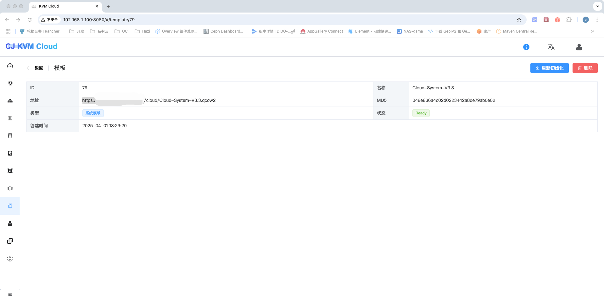
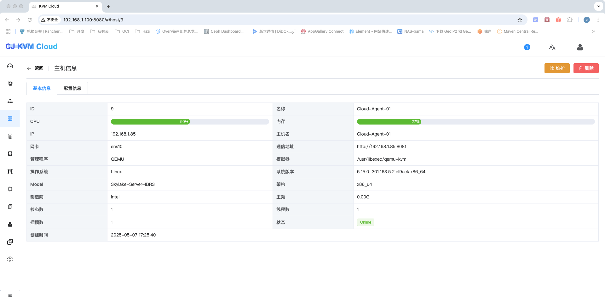

### 项目介绍
    KVM Cloud是一款基于KVM实现的适用于小微企业的虚拟机管理系统，支持如下功能:
    1、基于KVM的VM基础功能(创建、启动、停止、重装、webVNC等功能)
    2、使用NFS作为磁盘存储池
    3、支持简单用户权限
    4、支持磁盘动态添加取消
    5、多主机管理
    6、支持模版维护，用于快速创建VM
    7、简单群组功能
    8、虚拟机IP自动管理
    9、多网卡支持
### 操作系统
Linux
### SELinux配置
```sh
setenforce 0
vi /etc/selinux/config
SELINUX=permissive
```
### 防火墙配置
```sh
systemctl stop firewalld
systemctl disable firewalld
systemctl stop iptables
systemctl disable iptables
```
### NFS配置
#### 1、安装NFS软件包
```sh
yum -y install nfs-utils rpcbind
```
#### 2、设置开机自启以及启动服务
```sh
systemctl enable rpcbind
systemctl enable nfs-server
systemctl start rpcbind
systemctl start nfs-server
```
#### 3、新建存储文件夹
```sh
mkdir -p /data/nfs
```
#### 4、编辑配置
```sh
vi /etc/exports
/data/nfs *(rw,async,no_root_squash)
```
#### 5、重新加载exportfs文件
```sh
  exportfs -a
```
#### 6、编辑nfs配置
```sh
vi /etc/sysconfig/nfs
    LOCKD_TCPPORT=32803
    LOCKD_UDPPORT=32769
    MOUNTD_PORT=892
    RQUOTAD_PORT=875
    STATD_PORT=662
    STATD_OUTGOING_PORT=2020
```
#### 7、重新服务
```sh
systemctl restart rpcbind
systemctl restart nfs-server
```

#### 8、测试挂载是否正常
```sh
mount -t nfs 127.0.0.1:/data/nfs /mnt
df -h        ###查看有了代表成功
umount /mnt
```

### KVM
#### 1、验证主机是否支持虚拟化
```sh
 lsmod | grep kvm #查看结果确认是否支持虚拟化
 如果是vmware开启的虚拟机，请启用虚拟化技术
```
#### 2、主机安装KVM
```sh
yum install qemu-kvm libvirt bridge-utils
yum install java-1.8.0-openjdk* -y
```

#### 3、配置KVM 主机网桥，增加一个网桥
```sh
vi /etc/sysconfig/network-scripts/ifcfg-br0
    DEVICE="br0"
    TYPE="Bridge"
    ONBOOT="yes"
    BOOTPROTO=static
    IPADDR=192.168.2.130
    NATMASK=255.255.255.0
    PREFIX=24
    GATEWAY=192.168.2.1
    DNS1=8.8.4.4
    DNS2=8.8.8.8

vi /etc/sysconfig/network-scripts/ifcfg-eth0
    DEVICE="eth0"
    BOOTPROTO="static"
    NM_CONTROLLED="no"
    ONBOOT="yes"
    TYPE="Ethernet"
    BOOTPROTO=none
    BRIDGE="br0"
```
#### 4、VNC 配置  
```sh
vi /etc/libvirt/qemu.conf
    vnc_listen=0.0.0.0
```
#### 5、Libvirtd配置
```sh
vi /etc/libvirt/libvirtd.conf
    listen_tls = 0
    listen_tcp = 1
    tcp_port = "16059"
    auth_tcp = "none"
    mdns_adv = 0
vi /etc/sysconfig/libvirtd
    LIBVIRTD_ARGS="--listen"
systemctl restart libvirtd 
```
#### 项目编译
```sh
mvn clean package
```
### 完成配置
1、导入mysql表及相关数据
> **脚本位于scripts下**

2、修改配置文件

3、分别启动管理端及Agent端，浏览页面：http://localhost:8080/ (旧版本界面:http://localhost:8080/1.0/login.html)
```
管理端: java -jar cloud-management-1.0-SNAPSHOT.jar --spring.config.location=server.properties
Agent: java -jar cloud-agent-1.0-SNAPSHOT.jar --spring.config.location=client.properties
 --spring.config.location 是可选项，用于指定配置文件，如果不需要修改，可以去掉
```

4、平台登陆账号默认用户名/密码:admin/111111

5、创建集群


6、下载系统Route-VM与Console-VM

> **链接: https://pan.baidu.com/s/1c7Fvenhp9WfrdaqrBkbd8A 提取码: pw3g**


7、安装nginx，配置Route-VM和Console-VM下载地址,并在页面完成模版配置




 

8、创建网络

> **采用桥接网络配置，IP地址段与主机主机段需保持一致，可通过起始IP与结束IP和主机网络进行分离，防止IP冲突** 


9、创建主机





10、创建存储池(只支持nfs)


11、等待系统模版下载完成，并初始化系统VM成功

12、Console VM	负责Vnc连接、Route VM负责DHCP下发


13、windows附加磁盘时请安装virtio-win-0.1.185.iso驱动

14、系统VM用户名密码均为root/123456，请自行修改相关密码

15、上传ISO系统镜像

> **配置镜像时需要指定系统类型**

16、创建VM


### 相关问题

1、关于找不到配置文件问题导致数据库连接问题
```
server.properties 和 client.properties 内容分别为management和agent项目下的application.properties的文件，运行时自行修改名称
```
2、关于备份与恢复
```$xslt
对数据库和存储池进行完整备份，恢复时如果需要修改存储池IP，请调整tbl_storage_info标中storage_host的主机地址即可；
数据无价，建议对虚拟机中的数据进行备份
```
3、关于网络隔离
```$xslt
目前不支持自动创建隔离网络，可以通过创建两个桥接网络的方式进行隔离,大致步骤如下:
    1)、通过eth0创建桥接网络br0
    2)、通过br0创建vlan网络(例如br0.2)
    3)、通过创建的vlan再次创建桥接网络(例如br2)
    4)、在管理界面初始化网络br2
    5)、等待该网络的console和route虚拟机初始化完成
    6)、创建一台br0的网络的跳板虚拟机
    7)、为该跳板机附加br2对应的网络
    8)、外部访问vlan所对应的虚拟机，可通过该跳板机进行访问
```
4、个别windows系统无法找到引导的问题
```$xslt
    1)、首先确认创建的ISO系统类型是否正确
    2)、如果确认系统类型没有问题，可以通过老毛桃做一个PE的ISO镜像，在创建系统的时候可以通过PE镜像创建，然后进入PE系统，在页面上卸载光盘，重新挂载你要安装的操作系统，然后通过PE安装就可以正常安装了
```
5、windows系统附加磁盘不识别问题
```$xslt
    windows没有virto的驱动，请安装virtio-win-0.1.185.iso驱动
```
6、服务器掉电重启后处理
```$xslt
   1、服务器掉电重启后，请在页面手动关闭所有自己创建的虚拟机，然后重新启动，系统虚拟机有自动检测重启功能，无需处理
   2、掉电可能引起虚拟磁盘损坏，如无法启动，可通过qemu-img check检查并进行相应修复
```
### 捐赠支持
如果您觉得我们的开源项目对您有帮助，那就给开发者们加根鸡腿吧！当前接受来自于微信、支付宝或者码云的捐赠，请在捐赠时备注自己的昵称或附言。

|| |
|---|---|

### 捐赠名单
-------------------------------------------------------------------------------
|捐赠人|捐赠方式|捐赠金额(元)|捐赠时间|捐赠备注| 
|:----:|:------:|:----------:|:------:|:-------|
|pcgc-cn|微信|199.99|2021-11-12|| 
