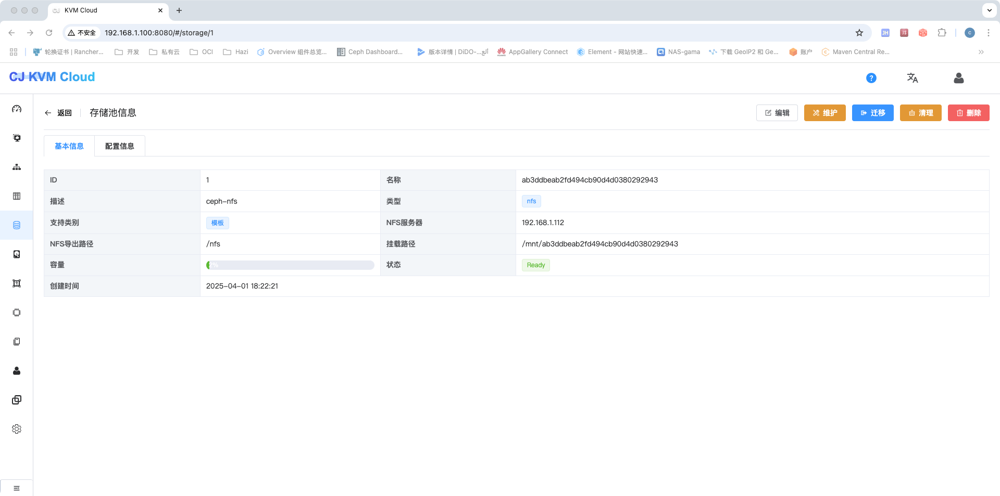
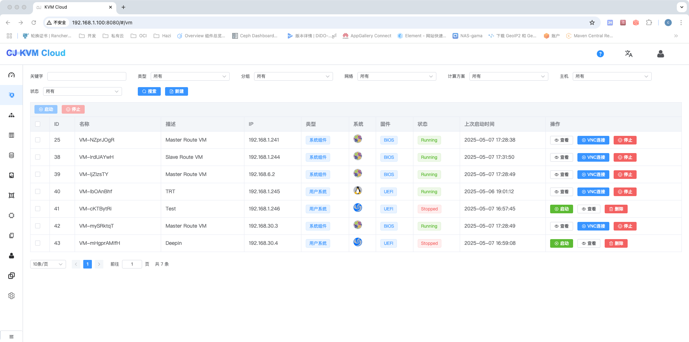

### 操作系统
Linux
### SELinux配置
```sh
setenforce 0
vi /etc/selinux/config
SELINUX=permissive
```
### 防火墙配置
```sh
systemctl stop firewalld
systemctl disable firewalld
systemctl stop iptables
systemctl disable iptables
```
### NFS配置
#### 1、安装NFS软件包
```sh
yum -y install nfs-utils rpcbind
```
#### 2、设置开机自启以及启动服务
```sh
systemctl enable rpcbind
systemctl enable nfs-server
systemctl start rpcbind
systemctl start nfs-server
```
#### 3、新建存储文件夹
```sh
mkdir -p /data/nfs
```
#### 4、编辑配置
```sh
vi /etc/exports
/data/nfs *(rw,async,no_root_squash)
```
#### 5、重新加载exportfs文件
```sh
  exportfs -a
```
#### 6、编辑nfs配置
```sh
vi /etc/sysconfig/nfs
    LOCKD_TCPPORT=32803
    LOCKD_UDPPORT=32769
    MOUNTD_PORT=892
    RQUOTAD_PORT=875
    STATD_PORT=662
    STATD_OUTGOING_PORT=2020
```
#### 7、重新服务
```sh
systemctl restart rpcbind
systemctl restart nfs-server
```

#### 8、测试挂载是否正常
```sh
mount -t nfs 127.0.0.1:/data/nfs /mnt
df -h        ###查看有了代表成功
umount /mnt
```

### KVM
#### 1、验证主机是否支持虚拟化
```sh
 lsmod | grep kvm #查看结果确认是否支持虚拟化
 如果是vmware开启的虚拟机，请启用虚拟化技术
```
#### 2、主机安装KVM
```sh
yum install qemu-kvm libvirt bridge-utils
yum install java-1.8.0-openjdk* -y
```

#### 3、配置KVM 主机网桥，增加一个网桥
```sh
vi /etc/sysconfig/network-scripts/ifcfg-br0
    DEVICE="br0"
    TYPE="Bridge"
    ONBOOT="yes"
    BOOTPROTO=static
    IPADDR=192.168.2.130
    NATMASK=255.255.255.0
    PREFIX=24
    GATEWAY=192.168.2.1
    DNS1=8.8.4.4
    DNS2=8.8.8.8

vi /etc/sysconfig/network-scripts/ifcfg-eth0
    DEVICE="eth0"
    BOOTPROTO="static"
    NM_CONTROLLED="no"
    ONBOOT="yes"
    TYPE="Ethernet"
    BOOTPROTO=none
    BRIDGE="br0"
```
#### 4、VNC 配置  
```sh
vi /etc/libvirt/qemu.conf
    vnc_listen=0.0.0.0
```
#### 5、Libvirtd配置
```sh
vi /etc/libvirt/libvirtd.conf
    listen_tls = 0
    listen_tcp = 1
    tcp_port = "16059"
    auth_tcp = "none"
    mdns_adv = 0
vi /etc/sysconfig/libvirtd
    LIBVIRTD_ARGS="--listen"
systemctl restart libvirtd 
```
#### 项目编译
```sh
mvn clean package
```
### 完成配置
1、导入mysql表及相关数据

2、修改配置文件

3、分别启动管理端及Agent端，浏览页面：http://localhost:8080/
```
管理端: java -jar cloud-management-1.0-SNAPSHOT.jar --spring.config.location=server.properties
Agent: java -jar cloud-agent-1.0-SNAPSHOT.jar --spring.config.location=client.properties
```

4、平台登陆账号默认用户名/密码:admin/111111

5、创建集群


6、下载系统Route-VM与Console-VM

```
链接: https://pan.baidu.com/s/1c7Fvenhp9WfrdaqrBkbd8A 提取码: pw3g
```

7、安装nginx，配置Route-VM和Console-VM下载地址,并在页面完成模版配置


8、创建网络


9、创建主机


10、创建存储池(只支持nfs)





11、等待系统模版下载完成，并初始化系统VM成功

12、Console VM	负责Vnc连接、Route VM负责DHCP下发





13、windows附加磁盘时请安装virtio-win-0.1.185.iso驱动

14、系统VM用户名密码均为root/123456，请自行修改相关密码

15、创建VM


### VLAN-暂不支持
```
yum install vconfig -y
modprobe 8021q
lsmod | grep -i 8021q
 

vim /etc/sysconfig/network-scrips/ifcfg-br0.30 
TYPE=Ethernet
DEVICE=br0.30
ONBOOT=yes
BOOTPROTO=static
NM_CONTROLLED=no
VLAN=yes
BRIDGE=br0-30

vim  /etc/sysconfig/network-scrips/ifcfg-br0-30
TYPE=Bridge
DEVICE=br0-30
ONBOOT=yes
NM_CONTROLLED=no
BOOTPROTO=static

```
