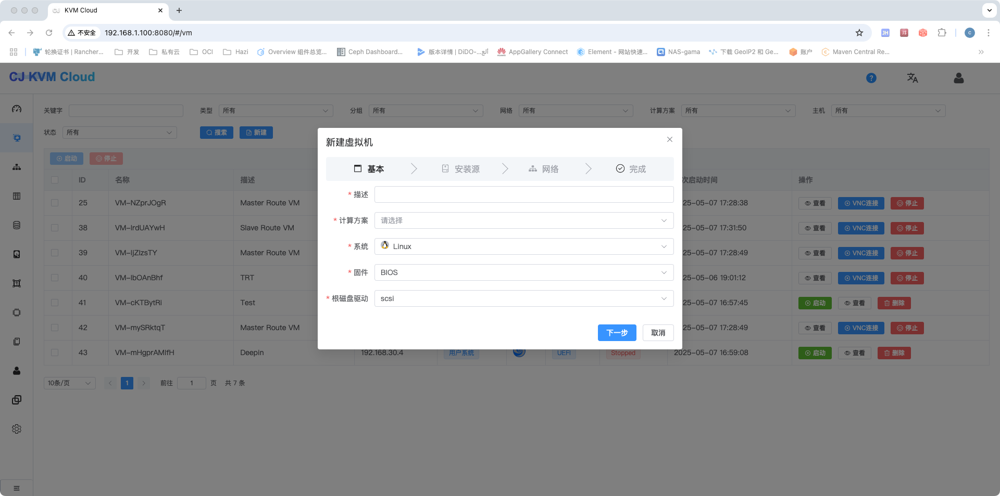
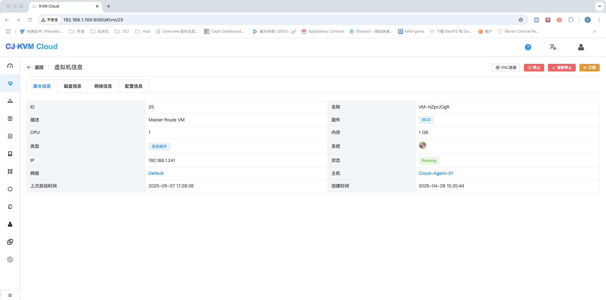

### 项目介绍
    KVM Cloud 是一款基于Java实现的轻量级私有云平台，旨在帮助中小企业快速实现计算、存储、网络等资源的管理，让企业拥有自己的云平台，包括但不限于如下功能:
    1、基于KVM的VM基础功能(创建、启动、停止、重装、webVNC等功能)
    2、支持NFS、glusterfs磁盘存储池
    3、支持磁盘动态添加取消
    4、多主机管理
    5、支持模版维护，用于快速创建VM
    6、虚拟机IP自动管理
    7、多网卡支持
    8、支持 raw、qcow、qcow2、vdi、vmdk、vpc磁盘格式
    9、磁盘快照支持
    10、通过OVS支持Vlan网络划分
    11、支持cloud-init配置系统密码
    12、支持内部dns解析
    13、支持nat转发

### 关于升级
    目前不支持V1、V2升级到最新版本
    V3.0升级时请重新上传系统模版文件Cloud-System-v3.1.qcow2(md5:2696ca0d762279bc386b03c8cea82cd7),并在模版页面点击重新下载
    新版本不在支持采用backingfile方式，升级前请确保所有磁盘文件没有父磁盘的依赖，如果有请通过clone方式将磁盘重新克隆，取消依赖关系，否则删除模版将导致磁盘不可用
### 操作系统
Linux(intel)
### SELinux配置
```sh
setenforce 0
vi /etc/selinux/config
SELINUX=permissive
```
### Sysctl配置 
```sh
vim /etc/sysctl.conf 
net.ipv4.ip_forward=1               # 设置转发并保存
sysctl -p
```
### 防火墙配置
```sh
systemctl stop firewalld
systemctl disable firewalld
systemctl stop iptables
systemctl disable iptables
```
### NFS配置
#### 1、安装NFS软件包
```sh
yum -y install nfs-utils rpcbind
```
#### 2、设置开机自启以及启动服务
```sh
systemctl enable rpcbind
systemctl enable nfs-server
systemctl start rpcbind
systemctl start nfs-server
```
#### 3、新建存储文件夹
```sh
mkdir -p /data/nfs
```
#### 4、编辑配置
```sh
vi /etc/exports
/data/nfs *(rw,async,no_root_squash)
```
#### 5、重新加载exportfs文件
```sh
  exportfs -a
```
#### 6、编辑nfs配置
```sh
vi /etc/sysconfig/nfs
    LOCKD_TCPPORT=32803
    LOCKD_UDPPORT=32769
    MOUNTD_PORT=892
    RQUOTAD_PORT=875
    STATD_PORT=662
    STATD_OUTGOING_PORT=2020
```
#### 7、重新服务
```sh
systemctl restart rpcbind
systemctl restart nfs-server
```

#### 8、测试挂载是否正常
```sh
mount -t nfs 127.0.0.1:/data/nfs /mnt
df -h        ###查看有了代表成功
umount /mnt
```

### KVM
#### 1、验证主机是否支持虚拟化
```sh
 lsmod | grep kvm #查看结果确认是否支持虚拟化
 如果是vmware开启的虚拟机，请启用虚拟化技术
```
#### 2、主机安装KVM
```sh
yum install qemu-kvm libvirt bridge-utils
yum install java-1.8.0-openjdk* -y
```

#### 3、配置KVM 主机网桥，增加一个网桥
这一步一定注意：使用`ip addr`查看你的`网卡名`，在`CentOS 7`中网卡名可能不是`eth0`，错误的网卡名会导致后期配置的虚拟机无法正常被访问到！
确认网卡名无误后配置网桥：
```sh
vi /etc/sysconfig/network-scripts/ifcfg-br0
    DEVICE=br0
    TYPE=Bridge
    ONBOOT=yes
    BOOTPROTO=static
    IPADDR=192.168.2.130
    NATMASK=255.255.255.0
    PREFIX=24
    GATEWAY=192.168.2.1
    DNS1=8.8.4.4
    DNS2=8.8.8.8

# 务必使用 ip addr 命令查看你的实际网卡名，他很可能不是eth0
# 如需ovs配置，请参考[OVS 网卡设置参考.txt](scripts%2FOVS%20%E7%BD%91%E5%8D%A1%E8%AE%BE%E7%BD%AE%E5%8F%82%E8%80%83.txt)
# 下面这个编辑命令注意改成 ifcfg-实际网卡名
vi /etc/sysconfig/network-scripts/ifcfg-eth0
# 下面这个DEVICE注意改成 实际网卡名
    BOOTPROTO=none
    NAME=eth0
    DEVICE=eth0
    ONBOOT=yes
    NM_CONTRLLED=no
    BRIDGE=br0
```

#### 4、VNC 配置  
```sh
vi /etc/libvirt/qemu.conf
    vnc_listen="0.0.0.0"
```
#### 5、Libvirtd配置
```sh
vi /etc/libvirt/libvirtd.conf
    listen_tls = 0
    listen_tcp = 1
    unix_sock_group = "root"
    unix_sock_rw_perms = "0777"
    auth_unix_ro = "none"
    auth_unix_rw = "none"
    tcp_port = "16509"
    listen_addr = "0.0.0.0"
    auth_tcp = "none"
vi /etc/sysconfig/libvirtd
    LIBVIRTD_ARGS="--listen"
systemctl restart libvirtd 
```
#### 项目编译
```sh
mvn clean package -Dfile.encoding=UTF-8 -DskipTests=true
```
### 完成配置
1、导入mysql表及相关数据
> **脚本位于scripts下**

2、安装Redis

3、修改配置文件

4、分别启动管理端及Agent端，浏览页面：http://localhost:8080/
```
管理端: java -jar cloud-management-1.0-SNAPSHOT.jar --spring.config.location=server.yaml
Agent: java -jar cloud-agent-1.0-SNAPSHOT.jar --spring.config.location=client.properties
 --spring.config.location 是可选项，用于指定配置文件，如果不需要修改，可以去掉,配置文件为各自模块下的src/main/resources/application.properties文件
```

5、平台登陆账号默认用户名/密码:admin/123456

6、创建基础网络

> **采用桥接网络配置，IP地址段与主机主机段需保持一致，可通过起始IP与结束IP和主机网络进行分离，防止IP冲突,Vlan只支持OVS方式**


7、创建主机


8、创建存储池(只支持nfs)


9、下载基础模版(系统模版选择cloud/v3/Cloud-System-V3.1.qcow2)

> **链接: https://pan.baidu.com/s/1bOAeuvFj8hG4skDaoZnYtQ?pwd=1bpn 提取码: 1bpn**


10、安装nginx，配置基础下载地址,并在页面完成模版配置


 


11、等待系统模版下载完成，并初始化系统VM成功

12、windows附加磁盘时请安装virtio-win.iso驱动 
 

13、创建VM








### 相关问题

1、关于找不到配置文件问题导致数据库连接问题
```
server.yaml 和 client.properties 内容分别为management和agent项目下的application.yaml和application.properties的文件，运行时自行修改名称及相关配置
```
2、关于备份与恢复
```$xslt
对数据库和存储池进行完整备份；
数据无价，建议对虚拟机中的数据进行备份
```
3、关于网络隔离
```$xslt
    1)、目前只支持OVS桥接状态下的Vlan模式，如需使用，请自行安装OVS。
    2)、负载均衡器可通过挂载基础网络网卡的方式自行实现。

```
4、个别windows系统无法找到引导的问题
```$xslt
    1)、首先确认创建的ISO系统类型是否正确
    2)、如果确认系统类型没有问题，可以通过老毛桃做一个PE的ISO镜像，在创建系统的时候可以通过PE镜像创建，然后进入PE系统，在页面上卸载光盘，重新挂载你要安装的操作系统，然后通过PE安装就可以正常安装了
```
5、windows系统磁盘不识别问题
```$xslt
    1)、windows没有virto的驱动，请安装virtio-win.iso驱动
    2)、如果是系统盘则需要在磁盘选择页面临时挂载virtio-win.iso驱动后安装或选择ide总线方式
```
6、服务器掉电重启后处理
```$xslt
   1、服务器掉电重启后，请在页面手动关闭所有自己创建的虚拟机，然后重新启动，系统虚拟机有自动检测重启功能，无需处理
   2、掉电可能引起虚拟磁盘损坏，如无法启动，可通过qemu-img check检查并进行相应修复
``` 
7、虚拟机虚拟化嵌套
```$xslt
1、验证KVM 宿主机是否启用了嵌套虚拟化：
    基于 Intel 的处理器运行以下命令：cat /sys/module/kvm_intel/parameters/nested
    基于 AMD 的处理器运行以下命令： cat /sys/module/kvm_amd/parameters/nested
    上述命令输出N /0表示嵌套虚拟化是禁用的。如果我们得到的输出是Y/1 则表示在您的宿主机已启用嵌套虚拟化
2、如果需要启用嵌套虚拟化，使用以下内容创建一个文件名为/etc/modprobe.d/kvm-nested.conf 的文件：
    options kvm-intel nested=1
    options kvm-intel enable_shadow_vmcs=1
    options kvm-intel enable_apicv=1
    options kvm-intel ept=1
3、reboot 重启机器
4、现在验证嵌套虚拟化功能是否启用
    cat /sys/module/kvm_intel/parameters/nested
``` 
8、cloud-init相关配置(如需禁用，请在管理配置文件中设置app.route.type:dhcp)
```$xslt
1、cloud-init只支持dnsmasq下发方式
2、cloud-init数据源采用NoCloud,请修改cloud相关配置如下:
    datasource:
      NoCloud:
        seedfrom: http://169.254.169.254/
    datasource_list: [  NoCloud ]

3、系统模板在安装cloud-init后手动设置相关配置
    1)、设置允许密码登录:设置ssh_pwauth:   1
    2)、可设置允许root登录:disable_root: 1 
    3)、ubuntu修改/etc/cloud/cloud.cfg.d/50-curtin-networking.cfg 保证默认网卡名和分配网卡名一致
    4)、目前只测试了Centos与Ubuntu，Windows请自行实现相关初始化行为
    5)、密码只对应默认用户，具体请查看system_info.default_user相关配置
    6)、其他配置请参照cloud-init相关配置进行安装
    7)、对系统模板请安装qemu-command-agent，并进行相关配置
    
    
4、目前只提供Centos7及Ubuntu18.04的系统模版，其他系统模版，请自行实现
    1）、Centos默认用户名为centos，密码为创建系统时输入的密码
    2）、Ubuntu默认用户名为ubuntu，密码为创建系统输入的密码
    3）、系统模版不支持root用户名密码登录，如需root登录，请自行修改

```
9、页面删除主机后，如需要重新加入主机，请删除该主机Agent目录下config.json，然后重启Agent

10、关于提示签名错误问题，请确保管理端跟agent端时间同步


